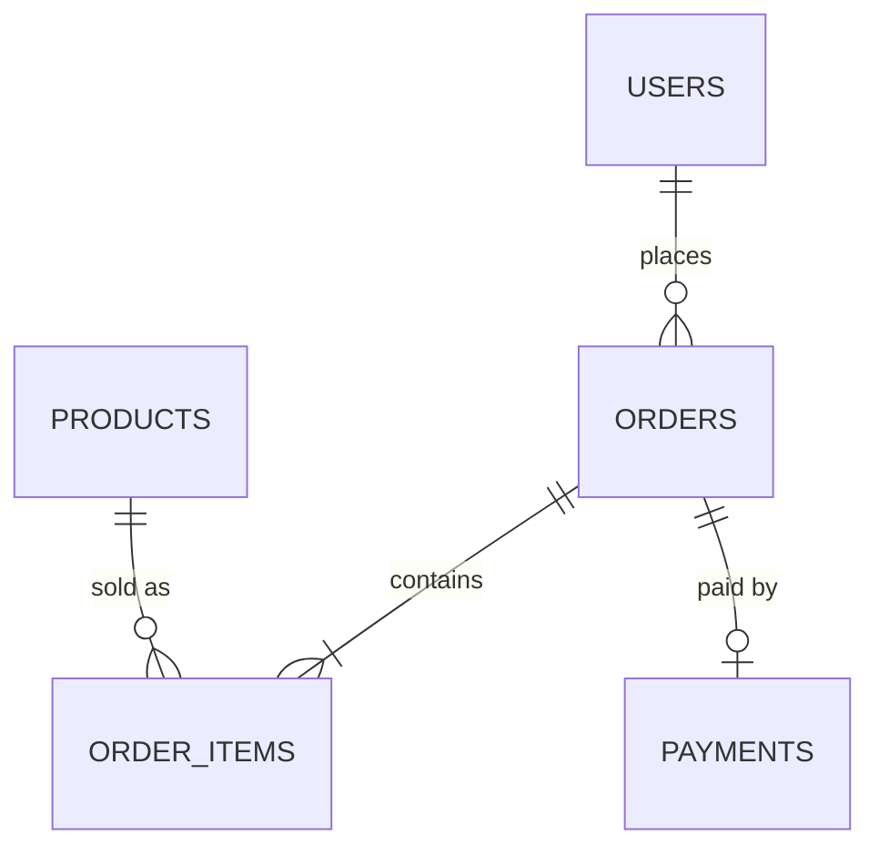

# Đặt hàng E-commerce

User đặt hàng nhiều sản phẩm trong 1 đơn, mỗi sản phẩm có giá **tại thời điểm mua** (giá sản phẩm có thể đổi sau đó), và không được bán vượt quá tồn kho khi nhiều người mua cùng lúc.



## Schema

```sql
CREATE TABLE users (
    id          BIGSERIAL PRIMARY KEY,
    email       TEXT NOT NULL UNIQUE,
    created_at  TIMESTAMPTZ NOT NULL DEFAULT now()
);

CREATE TABLE products (
    id          BIGSERIAL PRIMARY KEY,
    name        TEXT NOT NULL,
    price       NUMERIC(12,2) NOT NULL CHECK (price >= 0),
    stock_qty   INT NOT NULL CHECK (stock_qty >= 0)
);

CREATE TABLE orders (
    id          BIGSERIAL PRIMARY KEY,
    user_id     BIGINT NOT NULL REFERENCES users(id),
    status      TEXT NOT NULL DEFAULT 'pending'
                CHECK (status IN ('pending','paid','shipped','cancelled')),
    created_at  TIMESTAMPTZ NOT NULL DEFAULT now()
);

CREATE TABLE order_items (
    id          BIGSERIAL PRIMARY KEY,
    order_id    BIGINT NOT NULL REFERENCES orders(id),
    product_id  BIGINT NOT NULL REFERENCES products(id),
    quantity    INT NOT NULL CHECK (quantity > 0),
    unit_price  NUMERIC(12,2) NOT NULL  -- snapshot giá lúc mua, KHÔNG join sang products.price
);

CREATE INDEX idx_orders_user_id ON orders(user_id);
CREATE INDEX idx_order_items_order_id ON order_items(order_id);
```

## Điểm thiết kế đáng chú ý

- `order_items.unit_price` **cố ý denormalize** — lưu giá tại thời điểm mua thay vì join sang `products.price`. Nếu không, lịch sử đơn hàng sẽ đổi mỗi khi shop đổi giá.
- Trừ tồn kho phải nằm trong **cùng 1 transaction** với việc tạo `order_items`, và dùng `SELECT ... FOR UPDATE` (row lock) để tránh 2 request cùng lúc bán vượt tồn kho — đây là race condition kinh điển nếu chỉ `SELECT` rồi `UPDATE` riêng lẻ.
- `CHECK (stock_qty >= 0)` là lưới an toàn cuối cùng ở tầng DB, không thay thế được logic transaction ở tầng ứng dụng.

## Lưu ý

- Thay vì row lock bi quan (`FOR UPDATE`), có thể dùng **optimistic locking** (thêm cột `version`, `UPDATE ... WHERE version = :v`) nếu tỷ lệ tranh chấp thấp — tránh giữ lock lâu khi traffic cao.
- Isolation level mặc định `READ COMMITTED` là đủ cho pattern `FOR UPDATE` ở trên; không cần `SERIALIZABLE` (tốn hiệu năng hơn) trừ khi có logic đọc-rồi-quyết định phức tạp hơn.

## Ví dụ triển khai theo framework

API mẫu: thêm sản phẩm vào đơn hàng, khoá hàng tồn kho trong transaction, snapshot giá tại thời điểm mua.

- [Python — FastAPI](examples/fastapi_example.py) (SQLAlchemy, `with_for_update()`)
- [PHP — Laravel](examples/laravel_example.php) (Eloquent, `lockForUpdate()`)
- [Node.js — NestJS](examples/nestjs_example.ts) (TypeORM, `pessimistic_write` lock)
