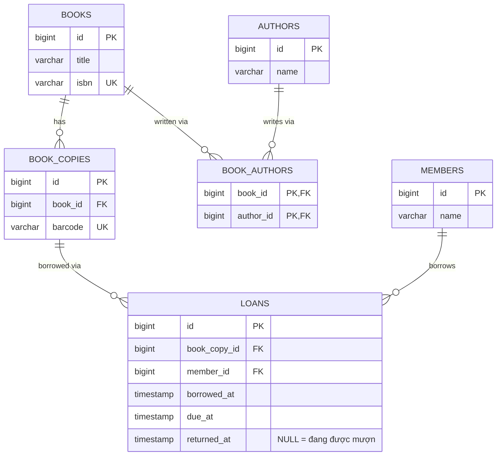

# Quản lý thư viện

1 đầu sách (`books`) có nhiều bản sao vật lý (`book_copies`); mỗi bản sao chỉ được mượn bởi 1 người tại 1 thời điểm; sách có nhiều tác giả và 1 tác giả viết nhiều sách (many-to-many).



## Schema

```sql
CREATE TABLE authors (
    id    BIGSERIAL PRIMARY KEY,
    name  TEXT NOT NULL
);

CREATE TABLE books (
    id     BIGSERIAL PRIMARY KEY,
    title  TEXT NOT NULL,
    isbn   TEXT UNIQUE
);

CREATE TABLE book_authors (  -- bảng trung gian cho quan hệ many-to-many
    book_id    BIGINT NOT NULL REFERENCES books(id),
    author_id  BIGINT NOT NULL REFERENCES authors(id),
    PRIMARY KEY (book_id, author_id)
);

CREATE TABLE book_copies (
    id       BIGSERIAL PRIMARY KEY,
    book_id  BIGINT NOT NULL REFERENCES books(id),
    barcode  TEXT NOT NULL UNIQUE
);

CREATE TABLE members (
    id     BIGSERIAL PRIMARY KEY,
    name   TEXT NOT NULL
);

CREATE TABLE loans (
    id             BIGSERIAL PRIMARY KEY,
    book_copy_id   BIGINT NOT NULL REFERENCES book_copies(id),
    member_id      BIGINT NOT NULL REFERENCES members(id),
    borrowed_at    TIMESTAMPTZ NOT NULL DEFAULT now(),
    due_at         TIMESTAMPTZ NOT NULL,
    returned_at    TIMESTAMPTZ  -- NULL = đang được mượn
);

-- Ràng buộc quan trọng nhất: 1 bản sao KHÔNG THỂ có 2 lượt mượn "đang mở" cùng lúc
CREATE UNIQUE INDEX idx_one_active_loan_per_copy
    ON loans(book_copy_id)
    WHERE returned_at IS NULL;
```

## Điểm thiết kế đáng chú ý

- `book_authors` là bảng trung gian (junction table) chuẩn cho quan hệ many-to-many — không thể nhét mảng `author_ids` vào `books` nếu muốn giữ tính chuẩn hoá của RDBMS (đây là điểm khác biệt lớn với Document DB, nơi nhúng mảng lại tự nhiên hơn).
- **Partial unique index** (`WHERE returned_at IS NULL`) là kỹ thuật PostgreSQL hay dùng để enforce "chỉ 1 bản ghi đang active" mà không cần cột trạng thái riêng hay trigger phức tạp.

## Lưu ý

- MySQL không hỗ trợ partial index — cách thay thế phổ biến là thêm cột generated `is_active BOOLEAN` và unique constraint trên `(book_copy_id, is_active)` với giá trị `is_active` chỉ là `TRUE`/`NULL` (MySQL cho phép nhiều `NULL` trong unique index, tương tự PostgreSQL).
- `INSERT` vi phạm unique index sẽ ném lỗi ràng buộc (`IntegrityError`/`QueryException`) — tầng ứng dụng chỉ cần bắt lỗi này thay vì tự `SELECT` kiểm tra trước (tránh race condition giữa lúc kiểm tra và lúc insert).

## Ví dụ triển khai theo framework

API mẫu: mượn sách (`POST /loans`) dựa vào partial unique index để chặn mượn trùng, trả sách (`POST /loans/{id}/return`).

- [Python — FastAPI](examples/fastapi_example.py) (SQLAlchemy, bắt `IntegrityError`)
- [PHP — Laravel](examples/laravel_example.php) (bắt `QueryException`)
- [Node.js — NestJS](examples/nestjs_example.ts) (TypeORM, bắt `QueryFailedError`)
