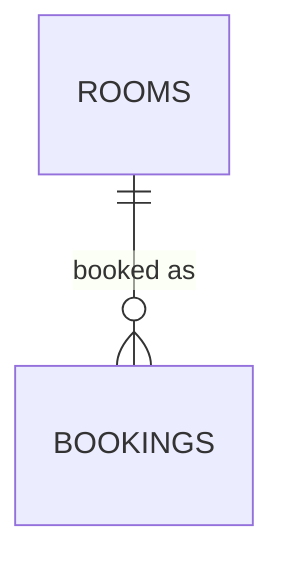

# Đặt phòng khách sạn — tránh double-booking

1 phòng không được đặt trùng khoảng ngày với 1 booking khác đã tồn tại. Đây là bài toán "tránh chồng lấn khoảng thời gian" (overlapping range), khó giải đúng bằng `CHECK` constraint thông thường vì phải so sánh với **các hàng khác**.



## Schema

```sql
CREATE EXTENSION IF NOT EXISTS btree_gist;

CREATE TABLE rooms (
    id     BIGSERIAL PRIMARY KEY,
    name   TEXT NOT NULL
);

CREATE TABLE bookings (
    id          BIGSERIAL PRIMARY KEY,
    room_id     BIGINT NOT NULL REFERENCES rooms(id),
    guest_name  TEXT NOT NULL,
    stay_range  DATERANGE NOT NULL,  -- vd: '[2026-08-20, 2026-08-23)'

    -- Không cho phép 2 booking của CÙNG 1 phòng có stay_range chồng lấn
    EXCLUDE USING gist (room_id WITH =, stay_range WITH &&)
);
```

## Điểm thiết kế đáng chú ý

- `EXCLUDE USING gist` là constraint đặc thù PostgreSQL, tổng quát hoá `UNIQUE` cho trường hợp "không được trùng theo nghĩa toán tử `&&` (overlap)" thay vì `=`. Nếu dùng MySQL (không có EXCLUDE constraint), phải tự kiểm tra chồng lấn trong transaction bằng `SELECT ... FOR UPDATE` trước khi `INSERT`, chấp nhận rủi ro race condition cao hơn.
- `DATERANGE` với nửa khoảng `[start, end)` giúp 2 booking liền kề (checkout ngày X, checkin cũng ngày X) không bị coi là chồng lấn — đúng thực tế khách sạn (trả phòng buổi sáng, khách mới nhận phòng buổi chiều cùng ngày).

## Lưu ý

- `CREATE EXTENSION btree_gist` là bắt buộc để dùng toán tử `=` trong index GiST trên cột kiểu số nguyên (`room_id`) kết hợp với `&&` trên `DATERANGE`.
- Nếu cần chống chồng lấn theo cả ngày lẫn giờ (vd: đặt phòng họp theo khung giờ), dùng `TSTZRANGE` thay cho `DATERANGE`, logic `EXCLUDE` giữ nguyên.

## Ví dụ triển khai theo framework

API mẫu: tạo booking, bắt lỗi vi phạm `EXCLUDE` constraint khi phòng đã được đặt trong khoảng ngày trùng.

- [Python — FastAPI](examples/fastapi_example.py) (SQLAlchemy, bắt `IntegrityError`)
- [PHP — Laravel](examples/laravel_example.php) (bắt `QueryException`)
- [Node.js — NestJS](examples/nestjs_example.ts) (TypeORM, bắt `QueryFailedError`)
