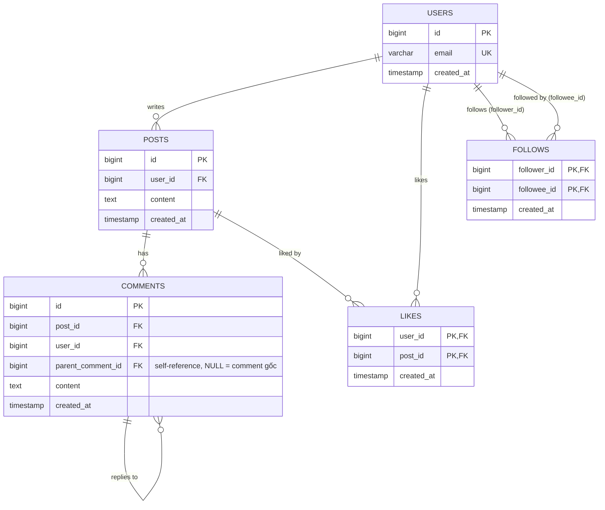

# Mạng xã hội / Blog — comment lồng nhau, follow

Bài viết có comment, comment có thể reply lẫn nhau (lồng nhiều cấp); user có thể follow user khác (quan hệ many-to-many trên cùng 1 bảng — self-referencing).



## Schema

```sql
CREATE TABLE posts (
    id          BIGSERIAL PRIMARY KEY,
    user_id     BIGINT NOT NULL REFERENCES users(id),
    content     TEXT NOT NULL,
    created_at  TIMESTAMPTZ NOT NULL DEFAULT now()
);

CREATE TABLE comments (
    id                  BIGSERIAL PRIMARY KEY,
    post_id             BIGINT NOT NULL REFERENCES posts(id),
    user_id             BIGINT NOT NULL REFERENCES users(id),
    parent_comment_id   BIGINT REFERENCES comments(id),  -- self-reference, NULL = comment gốc
    content             TEXT NOT NULL,
    created_at          TIMESTAMPTZ NOT NULL DEFAULT now()
);

CREATE TABLE likes (
    user_id     BIGINT NOT NULL REFERENCES users(id),
    post_id     BIGINT NOT NULL REFERENCES posts(id),
    created_at  TIMESTAMPTZ NOT NULL DEFAULT now(),
    PRIMARY KEY (user_id, post_id)  -- 1 user chỉ like 1 post 1 lần
);

CREATE TABLE follows (
    follower_id  BIGINT NOT NULL REFERENCES users(id),
    followee_id  BIGINT NOT NULL REFERENCES users(id),
    created_at   TIMESTAMPTZ NOT NULL DEFAULT now(),
    PRIMARY KEY (follower_id, followee_id),
    CHECK (follower_id <> followee_id)  -- không tự follow chính mình
);

CREATE INDEX idx_comments_post_id ON comments(post_id);
CREATE INDEX idx_follows_followee_id ON follows(followee_id);  -- phục vụ query "ai đang follow user X"
```

## Điểm thiết kế đáng chú ý

- `comments.parent_comment_id` tự tham chiếu vào chính bảng `comments` — dựng cây reply không giới hạn độ sâu chỉ với 1 cột, nhưng lấy toàn bộ thread (nhiều cấp) cần **recursive CTE** (`WITH RECURSIVE`) chứ không phải 1 `JOIN` đơn giản.
- `likes` và `follows` dùng **composite primary key** thay vì `id` riêng — vừa là khoá chính, vừa tự động đóng vai trò unique constraint chống like/follow trùng lặp, không cần thêm `UNIQUE INDEX` riêng.
- Feed "bài viết của người mình follow" là query tốn nhất hệ thống (join `follows` → `posts`, sort theo thời gian) — đây là lý do các mạng xã hội lớn thường **không** query trực tiếp RDBMS cho feed mà build feed trước (fan-out) và cache bằng Redis/Key-Value (xem [../../../redis/use-cases](../../../redis/use-cases/README.md)).

## Lưu ý

Không ORM nào có "adjacency list + recursive CTE" hoàn toàn miễn phí — nhưng cả 3 đều có cách triển khai thuần ORM (không viết raw SQL ở tầng ứng dụng), đánh đổi khác nhau:

- **SQLAlchemy**: có sẵn API `.cte(recursive=True)` ở tầng Core/ORM — build CTE bằng `select()`/`union_all()` trên chính model `Comment`, không cần chuỗi SQL, không cần đổi schema.
- **Laravel/Eloquent**: không có API dựng sẵn, dùng package phổ biến [`staudenmeir/laravel-adjacency-list`](https://github.com/staudenmeir/laravel-adjacency-list) — package tự sinh CTE phía dưới, code Model/Controller chỉ gọi scope Eloquent (`whereIsRoot()`, `tree()`, `toTree()`), không cần đổi schema.
- **TypeORM**: dùng tính năng dựng sẵn `@Tree('closure-table')` + `TreeRepository` — không viết SQL, nhưng TypeORM tự tạo thêm 1 bảng phụ `comments_closure` để cache quan hệ ancestor/descendant (bảng `comments` gốc không đổi).
- Nếu thread thường xuyên rất sâu (hàng trăm cấp reply), cân nhắc giới hạn độ sâu ở tầng ứng dụng (UI) thay vì để truy vấn đệ quy chạy vô hạn.

## Ví dụ triển khai theo framework

API mẫu: lấy toàn bộ thread comment của 1 bài viết (sắp xếp theo độ sâu/lồng cây), hoàn toàn qua ORM.

- [Python — FastAPI](examples/fastapi_example.py) (SQLAlchemy, CTE đệ quy dựng bằng `select().cte(recursive=True)`)
- [PHP — Laravel](examples/laravel_example.php) (Eloquent + package `staudenmeir/laravel-adjacency-list`)
- [Node.js — NestJS](examples/nestjs_example.ts) (TypeORM, `@Tree('closure-table')` + `TreeRepository`)
