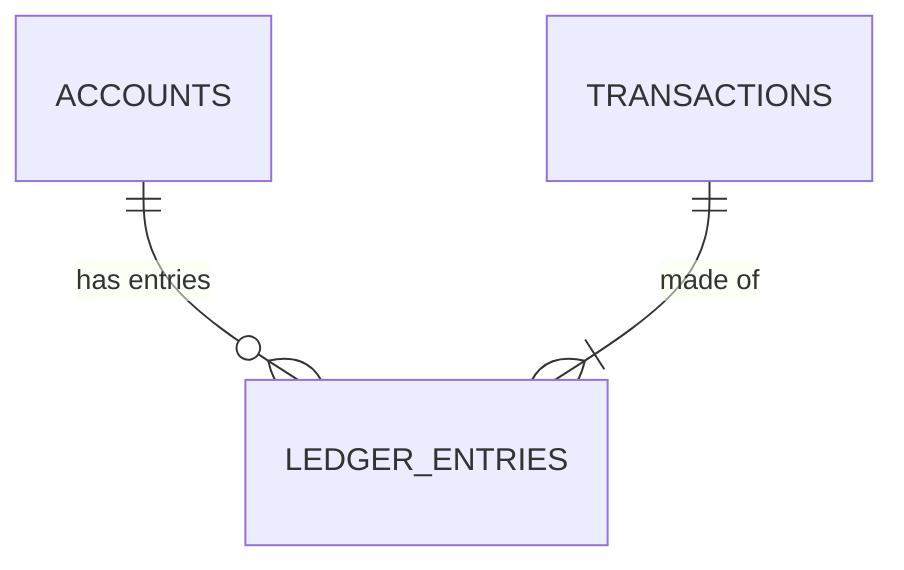

# Sổ cái ngân hàng — double-entry ledger

Mọi giao dịch tài chính phải tuân thủ nguyên tắc **bút toán kép** (double-entry bookkeeping) — 1 giao dịch chuyển tiền tạo ra ít nhất 2 dòng ghi sổ (1 Nợ, 1 Có), và **tổng luôn phải bằng 0**. Đây là bài toán ACID kinh điển đã nhắc ở [../../../comparisons](../../../comparisons/README.md#41-ngành-ngân-hàng--giao-dịch-tài-chính).



## Schema

```sql
CREATE TABLE accounts (
    id            BIGSERIAL PRIMARY KEY,
    owner_name    TEXT NOT NULL,
    currency      TEXT NOT NULL DEFAULT 'VND'
);

CREATE TABLE transactions (
    id           BIGSERIAL PRIMARY KEY,
    description  TEXT NOT NULL,
    created_at   TIMESTAMPTZ NOT NULL DEFAULT now()
);

CREATE TABLE ledger_entries (
    id              BIGSERIAL PRIMARY KEY,
    transaction_id  BIGINT NOT NULL REFERENCES transactions(id),
    account_id      BIGINT NOT NULL REFERENCES accounts(id),
    -- amount dương = ghi Có (credit), âm = ghi Nợ (debit)
    amount          NUMERIC(18,2) NOT NULL CHECK (amount <> 0)
);

CREATE INDEX idx_ledger_entries_account_id ON ledger_entries(account_id);
CREATE INDEX idx_ledger_entries_transaction_id ON ledger_entries(transaction_id);
```

```sql
-- Chuyển 500,000 VND từ account 1 sang account 2 — luôn nằm trong 1 transaction duy nhất
BEGIN;
    INSERT INTO transactions (description) VALUES ('Transfer 500000 VND') RETURNING id;
    -- transaction_id = 42 (ví dụ)
    INSERT INTO ledger_entries (transaction_id, account_id, amount) VALUES (42, 1, -500000);
    INSERT INTO ledger_entries (transaction_id, account_id, amount) VALUES (42, 2,  500000);
COMMIT;
```

## Điểm thiết kế đáng chú ý

- **Không lưu "số dư" trực tiếp** trên `accounts` — số dư luôn được **tính** bằng `SUM(amount) WHERE account_id = ?` từ `ledger_entries`. Cách này đảm bảo lịch sử không thể bị sửa mà không để lại dấu vết (append-only), rất quan trọng cho audit trail.
- Ràng buộc "tổng các dòng trong 1 `transaction_id` phải bằng 0" **khó enforce bằng `CHECK` constraint thuần** (CHECK chỉ thấy 1 hàng tại 1 thời điểm ở hầu hết RDBMS) — thường enforce bằng **trigger** (`AFTER INSERT` kiểm tra `SUM(amount)` theo `transaction_id`) hoặc bằng cách bọc chặt trong tầng service, không bao giờ cho phép insert `ledger_entries` ngoài 1 transaction có kiểm soát.
- Đây chính là lý do RDBMS gần như bắt buộc cho core banking: cần `BEGIN...COMMIT` bao trọn nhiều `INSERT`/`UPDATE` trên nhiều bảng, đảm bảo **atomic tuyệt đối** — nếu dòng thứ 2 lỗi, dòng thứ 1 phải rollback, không có trạng thái "nửa vời".

## Lưu ý

- Tính `SUM()` mỗi lần đọc số dư sẽ chậm dần khi lịch sử giao dịch tăng lên — production thường thêm bảng `account_balances` (denormalize số dư hiện tại, cập nhật cùng transaction với `ledger_entries`) chỉ để đọc nhanh, `ledger_entries` vẫn là nguồn sự thật duy nhất.
- Không bao giờ cho phép `UPDATE`/`DELETE` trên `ledger_entries` đã ghi — muốn sửa sai thì tạo **bút toán đảo** (reversal entry) mới, giữ nguyên tính append-only.

## Ví dụ triển khai theo framework

API mẫu: chuyển tiền giữa 2 tài khoản (tạo transaction + 2 dòng ledger trong cùng 1 DB transaction), truy vấn số dư.

- [Python — FastAPI](examples/fastapi_example.py) (SQLAlchemy, transaction thủ công)
- [PHP — Laravel](examples/laravel_example.php) (`DB::transaction`)
- [Node.js — NestJS](examples/nestjs_example.ts) (TypeORM, `dataSource.transaction`)
